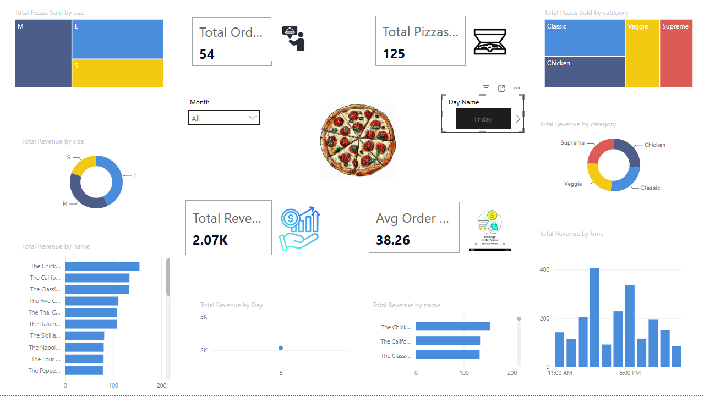

# Pizza Sales Performance & Inventory Optimization
**An End-to-End Data Analysis Project (Maven Pizza Challenge)**

## 📋 Project Objective
To provide a 360-degree view of sales operations for a pizza store to help optimize menu offerings, pricing strategy, and kitchen inventory management.

## 🛠️ Tech Stack
- **Excel:** Initial data audit.
- **Python (Pandas):** Data cleaning, merging, and ingredient "explosion" for inventory forecasting.
- **SQL (MySQL):** Business problem solving and trend analysis.
- **Power BI:** Interactive dashboarding and storytelling.

## 📈 Key Insights
- **Peak Hours:** Highest order volume occurs during lunch (12:00 PM) and dinner (6:00 PM).
- **Top Performer:** The Thai Chicken Pizza is the #1 revenue generator.
- **Inventory:** Garlic and Tomatoes are the most used ingredients, requiring daily restock.
- **Pricing:** Large pizzas contribute ~45% of total revenue.

## 🚀 How to Run
1. Run the Python script in `/Scripts` to generate the cleaned datasets.
2. Import the SQL schema and run the queries in `/Scripts` to see the logic.
3. Open the `.pbix` file in Power BI Desktop to view the interactive dashboard.

## 📸 Dashboard Preview

